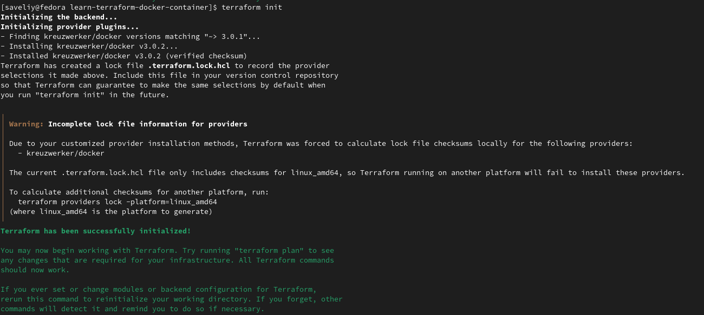
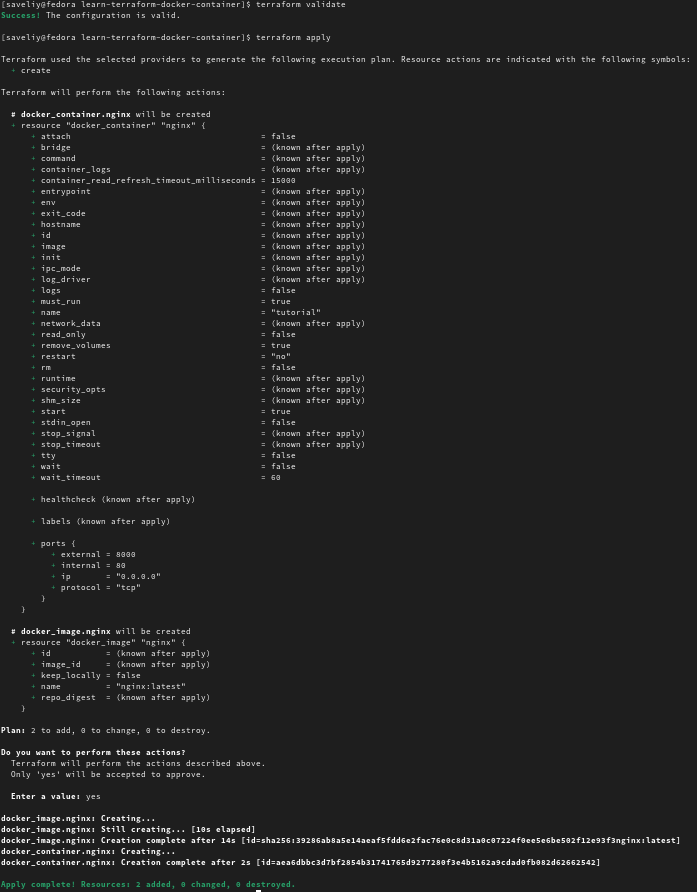
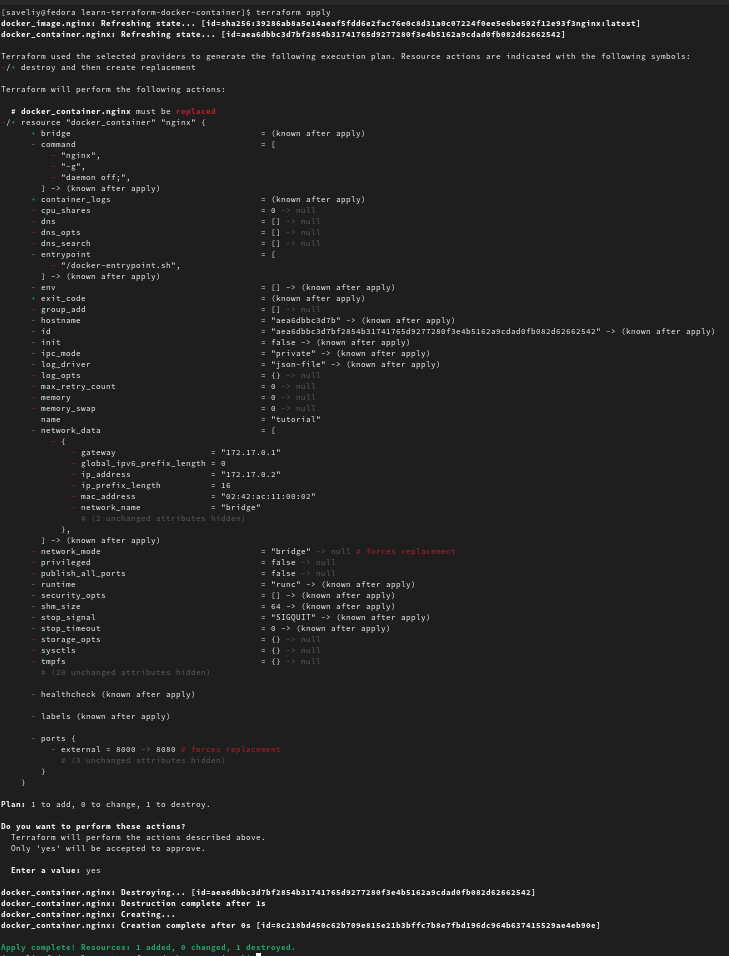
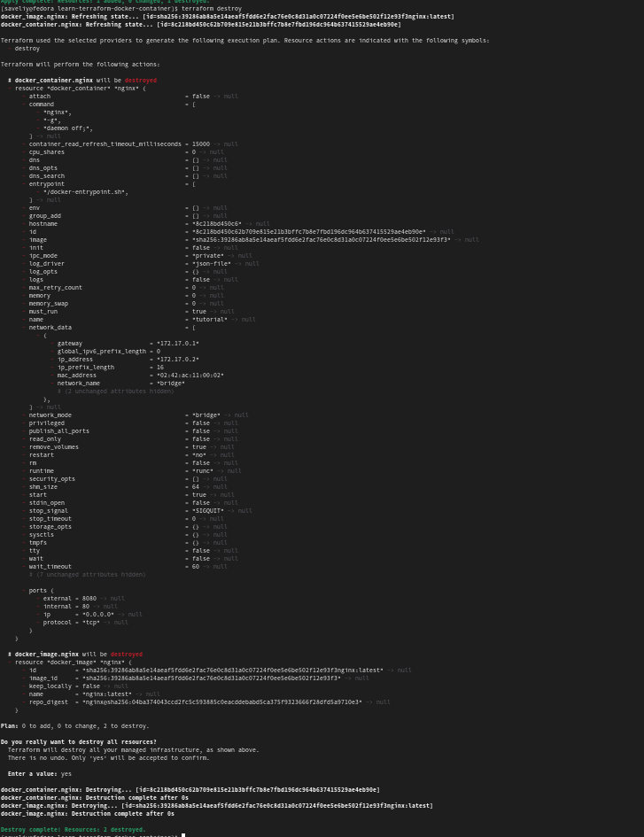

# Terraform version
```
Terraform v1.10.0-dev
on linux_amd64
```
took from `Terraform version`

# Terraform installation
1. I downloaded sorce code from oficial github
2. I compiled it with go compiler
3. Added compiled bin file to `/usr/local/bin` to make it available as command in terminal

# Terraform usage
## Creation
to initialize I ran `terraform init`


To apply it I ran `terraform apply`.


config file used for initialization is `create.tf`
## Updating
I changed the external port for nginx server from 8000 to 8080. Config file used in this step `update.tf`

I applied this changes by `terraform apply`.


## Destroying
To destroy infrastructure I ran `terraform destroy`



# Challenges
Due to USA sanctions it was impossible to download any packages from official mirrors of hashicorp. So to deal with it I had to compile terraform from source code and change terraform network mirror as described in [this guide](https://habr.com/ru/articles/807563/)