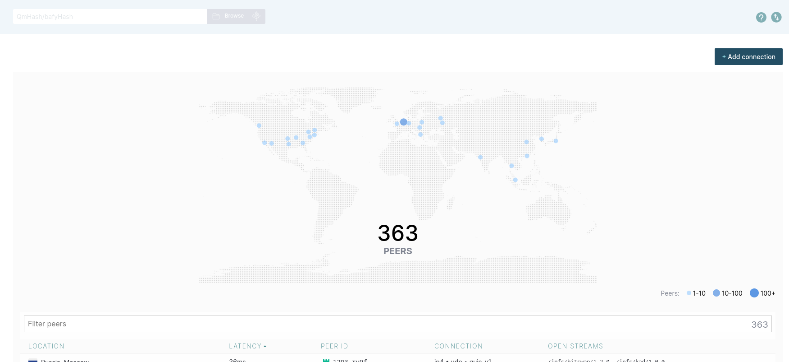

# Task 1
## Top usage
|#| CPU | Memory | I/O| space usage(files)|
|-|-|-|-| -|
|1|htop|telegram|systemd| coredump
|2|gnom-shell|firefox|systemd-journald| .browse.VC.db
|3|firefox|vscode|systemd-userdbd| gnome-42-2204_141.snap

## Documentation
### cpu usage statistics

I took 3 top lines because sorted by CPU usage in command.
### memory usage statistics

Because this 3 applications have many processes I decided to treat all this processes as 1 for this task. Last application is plugin for VCcode due to it I decided to name it `vscode` in table

### IO rate

All top applications are created by `root` user, so it can be some processes for managing OS.

### most large files in /var

All largest files in this directory are system files.