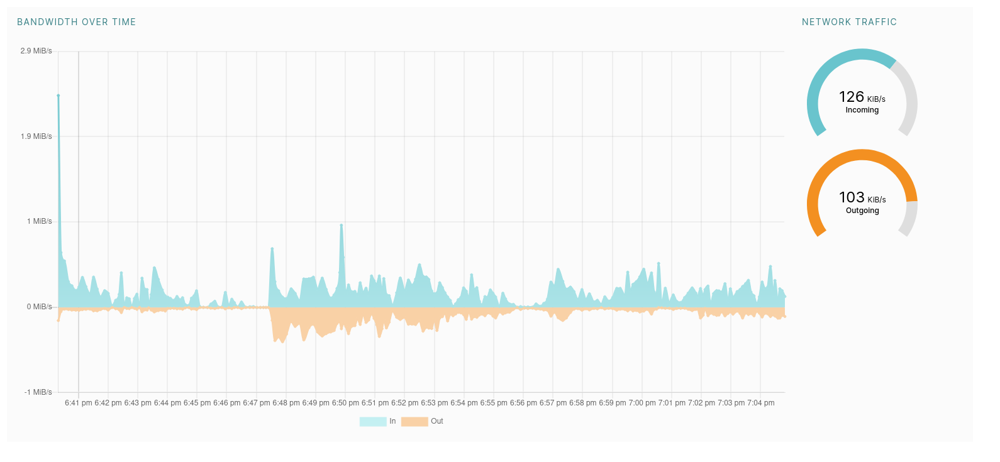
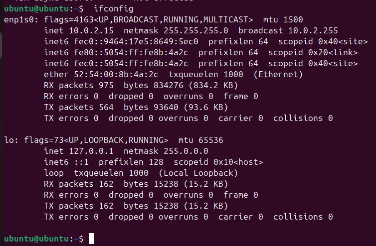

# Task 1

## version

I used `boxes 46.1-stable`

## setting up

1. I choosed initial settings:
   - ubuntu for OS
   - BIOS as firmware
   - 4 GB of RAM
   - 25 GB of disk storage
  

2. To change settings of VM I opened special window by pressing LMB on it in GUI and choosing `preferences`
   
   

## working OS

# Task 2

## CPU information

For getting information about the CPU I used `lscpu`

## Memory information

For getting information about the CPU I used `sudo dmidecode --type 17 | more`

## Network information

For getting information about the network I used `ifconfig`

## OS information
to get OS information I used `uname -a`

